# One Day In Rails 6 World

We have created a story to highlight the new features of Rails 6 which interested us the more. Of course, the list is non-exhaustive and we assume to not being Rails 6 -ready for now.

You will discover new things on Rails 6, you will be surprised and /or disappointed, but the story begins now!

[🎬 Watch the video of the talk at Lyon.rb meetup](https://www.youtube.com/watch?v=GjzSCqVs1P4)

### Summary

- [Rails new](#cb20c48---rails-new)
- [Rails scaffold](#aa08e13---rails-scaffold)
- [Install ActionText](#3db2068---install-actiontext)
- [Add rich text to Changelog](#013d262---add-rich-text-to-changelog)
- [Avoid N+1 query issue](#4006f5c---avoid-n1-query-issue)
- [Override confirm dialog](#5134bb8---override-confirm-dialog)
- [AR::Errors#of_kind?](#c727ff7---arerrorsof_kind)
- [Parallel Testing](#5ea2a86---parallel-testing)
- [ActiveSupport::ActionableError](#5886e94---activesupportactionableerror)
- [Disable default scopes](#ab7c9cc---disable-default-scopes)
- [Override implicit ordering](#ce6015d---override-implicit-ordering)
- [AR and Infinite Ranges](#c92862e---ar-and-infinite-ranges)
- [ActionView Allocation Instrumentation](#14657fb---actionview-allocation-instrumentation)
- [Multi databases](#caa5ba5---multi-databases)
- [ActionMailbox](#53f054b---actionmailbox)
- [Conclusion](#conclusion)
- [References](#references)

## [`#cb20c48`](https://github.com/perangusta/one-day-in-rails6-world/commit/cb20c48) - Rails new

Today, we will be creating a new application to publish the changelogs of [Per Angusta's product](https://www.per-angusta.com/en).

As standard Rails developers, we run the `rails new` command to bootstrap our new project. We are able to see the appearing of three brand new dependencies (`zeitwerk`, `actionmailbox`, `actiontext`) and a new folder in the tree `app/javascripts/packs` which is marking the arrival of Webpack as the main JavaScript dependencies manager (via `webpacker`).

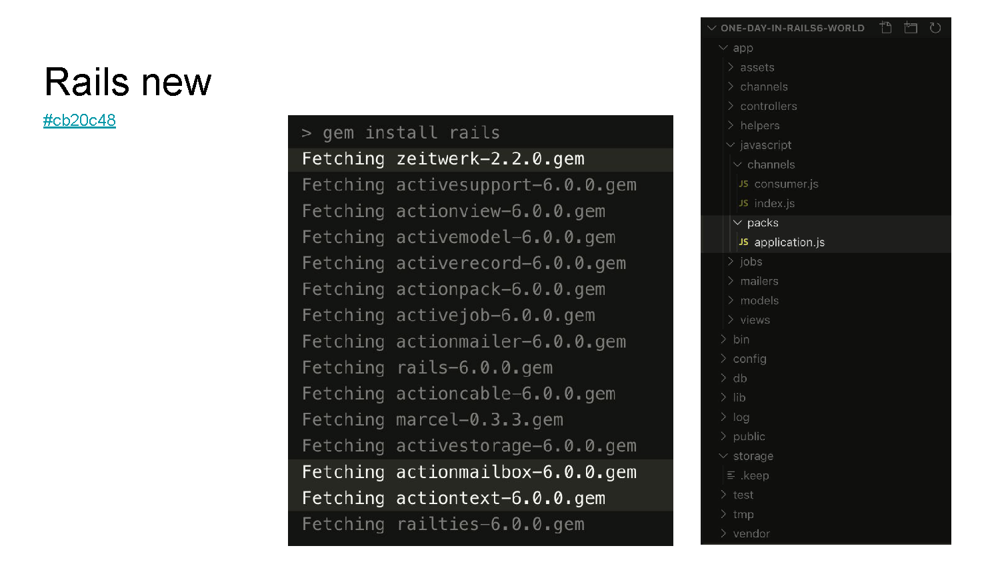

## [`#aa08e13`](https://github.com/perangusta/one-day-in-rails6-world/commit/aa08e13) - Rails scaffold

Our application needs a `Changelog` model with `title` and `description` columns, let's bootstrap it with the `rails scafflod` command and then run the migration.

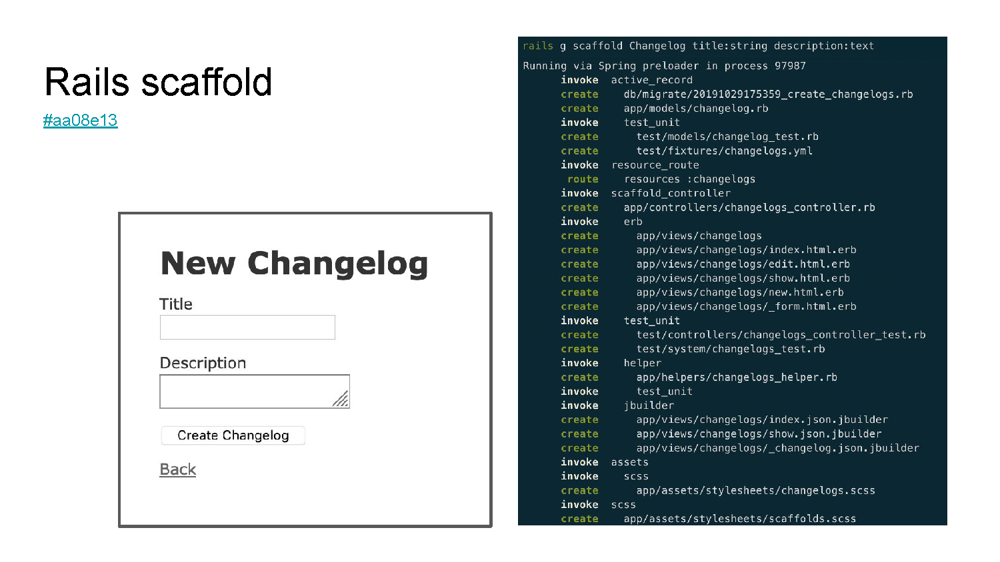

## [`#3db2068`](https://github.com/perangusta/one-day-in-rails6-world/commit/3db2068) - Install ActionText

It is however inconceivable to display plain text to the visitors, so let's install `ActionText` to handle rich content description including attachments in our model `Changelog` by running the `rails action_text:install` command.

As you can see, the installation of `ActionText` also results in `ActiveStorage` installation as a dependency for attachments handling.

## [`#013d262`](https://github.com/perangusta/one-day-in-rails6-world/commit/013d262) - Add rich text to Changelog

Then the setup of `Actiontext` is as easy as a few lines of code (Model and views), but hey, I have not migrated anything! Amazing...

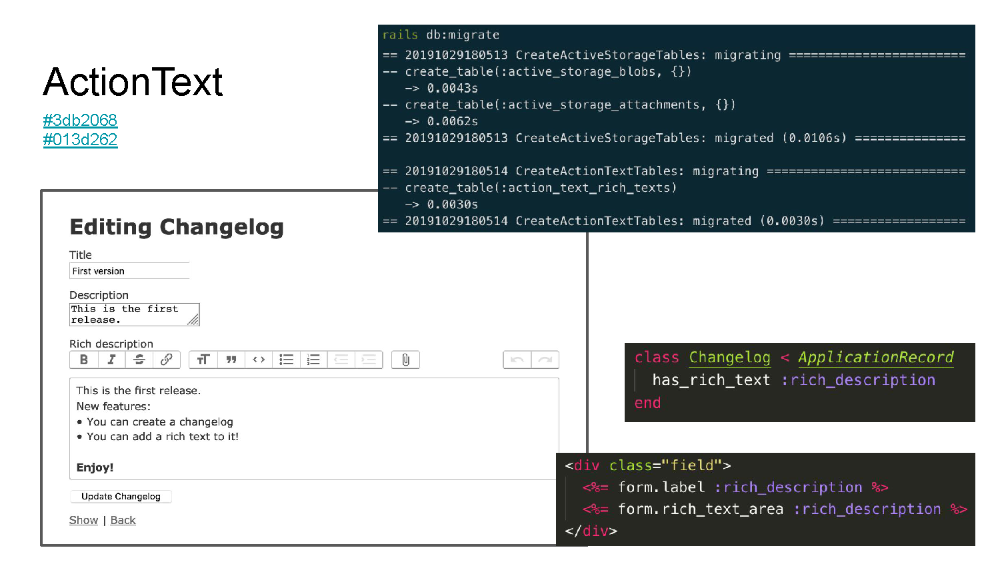

## [`#4006f5c`](https://github.com/perangusta/one-day-in-rails6-world/commit/4006f5c) - Avoid N+1 query issue

Did you know that rich content is stored in a third party table `action_text_rich_texts`? Let's avoid the N+1 query issue in our index view by using the builtin helpers for eager loading.

ERRATUM: Note that `with_rich_text_content_and_embeds` does not fully result in expected optimization since it does not solve N+1 query issue of embedded images. 

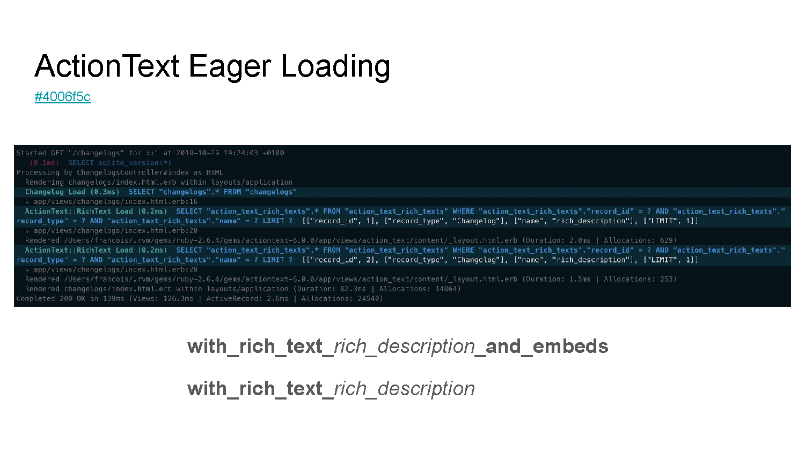

## [`#5134bb8`](https://github.com/perangusta/one-day-in-rails6-world/commit/5134bb8) - Override confirm dialog

Having tested the deletion feature of our records, we realised that the UI of the confirm dialog was not consistent across navigators. Let's override with custom HTML thanks to the exposure of Rails UJS's `confirm` function.

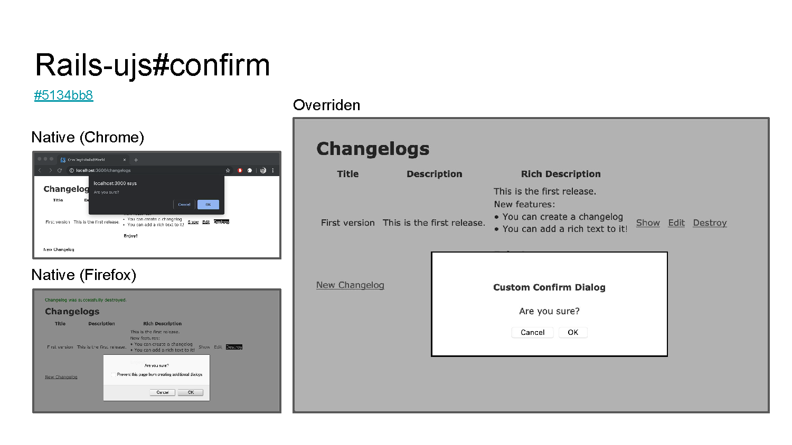

## [`#c727ff7`](https://github.com/perangusta/one-day-in-rails6-world/commit/c727ff7) - AR::Errors#of_kind?

A changelog without any title would be kind of strange, is'nt it? Let's add a `presence` validation and our first test. We can now take advantage of the new `kind_of?` interface to make this kind of tests more readable.

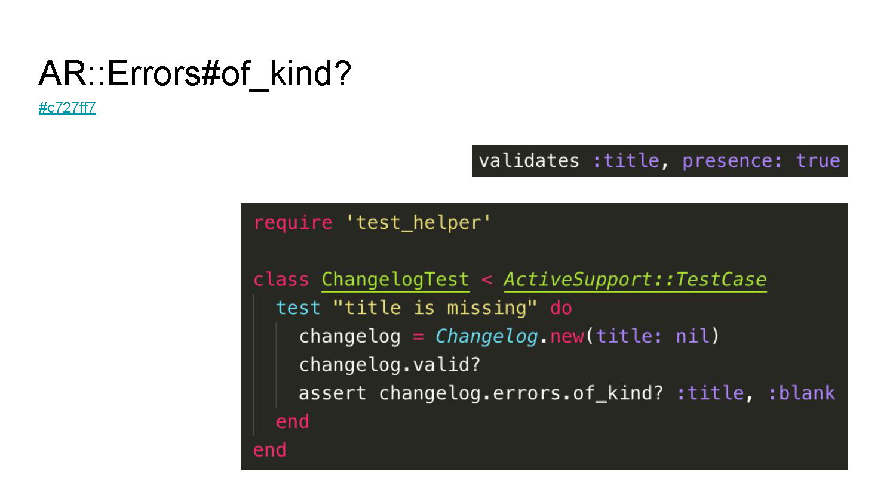

## [`#5ea2a86`](https://github.com/perangusta/one-day-in-rails6-world/commit/5ea2a86) - Parallel Testing

We should also add a validation on the description field because users always need to be guided. Let's say the description must be 3 characters length or more, and add a test.

Did you know that Rails 6 is now bringing parallel testing by default? By appending a `sleep` command, we can highlight the new behavior: Before around `8 seconds` and after around `5.5 seconds` using parallel testing.

Be aware that it may not be compatible with your existing test suite!

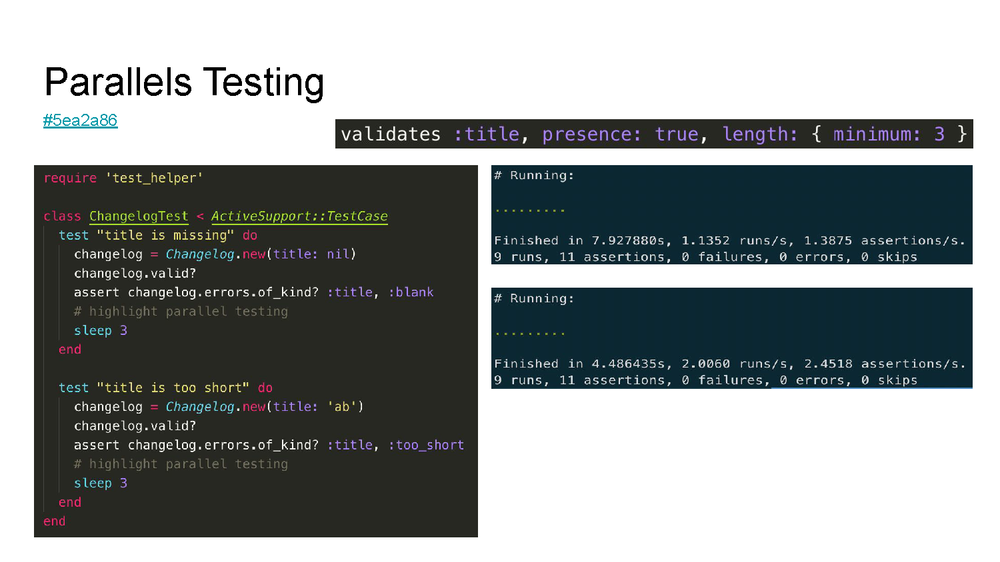

## [`#5886e94`](https://github.com/perangusta/one-day-in-rails6-world/commit/5886e94) - ActiveSupport::ActionableError

What about not publishing our changelogs by default on creation by implementing a status with an `enum`. Let's create the migration, update the model, views and controller and manually test it!

Wait! Here is the famous `PendingMigrationError` exception raised by visiting our application. Note that there is a button `Run pending migrations`. brought by the new `ActionableError` interface. It's available for all exceptions, like ours `ChangelogMissingError` which now is capable to seed the database directly through the Web interface.

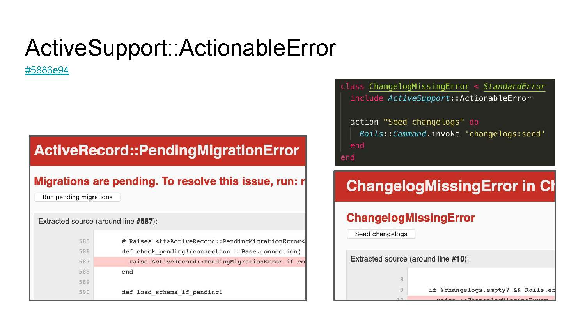

## [`#ab7c9cc`](https://github.com/perangusta/one-day-in-rails6-world/commit/ab7c9cc) - Disable default scopes

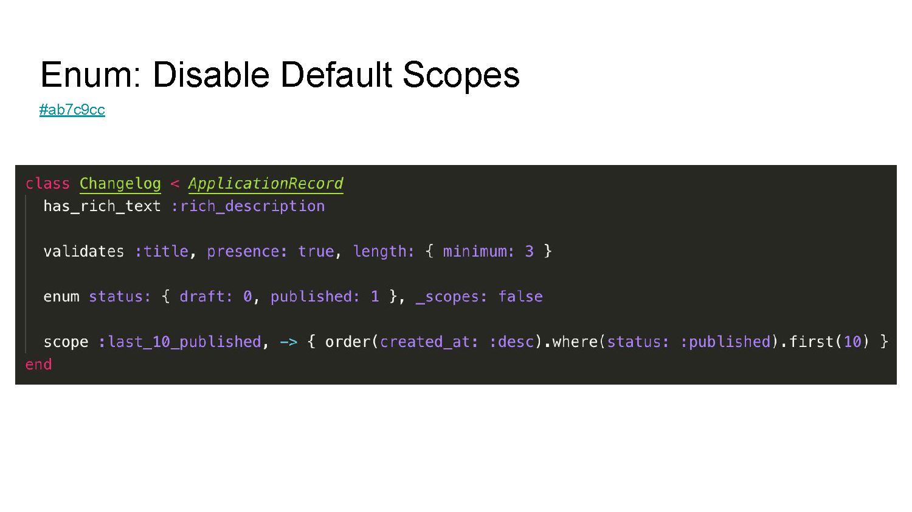

Did you know that declaring an `enum` results in loading of hidden `ActiveRecord` scopes on the models? Because we do not need them, we can disable them using the new option `_scopes: false` and then create our proper scope "The 10 latest changelogs".

## [`#ce6015d`](https://github.com/perangusta/one-day-in-rails6-world/commit/ce6015d) - Override implicit ordering

Let's add a new widget on our homepage to display "The latest changelog" using `Changelog.last`.

By default, Rails orders the records using the primary key (`id` column) in order to determine the `first` and the `last` records. In our context, the latest ID does not necessarily mean "the latest published changelog" since we added a status. Let's override the implicit ordering of `Changelog` model with `updated_at` column to fake the behavior "Give me the last updated changelog passed in `published` status".

Note that the common use case context of this feature is when you have UUID primary keys in your database.

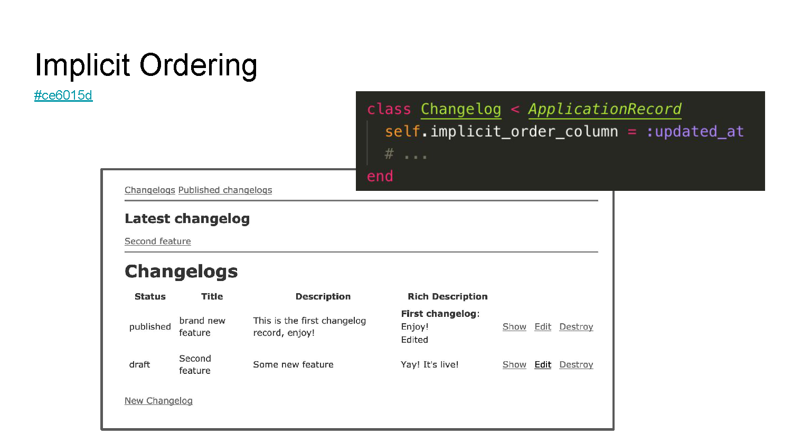

## [`#c92862e`](https://github.com/perangusta/one-day-in-rails6-world/commit/c92862e) - AR and Infinite Ranges

Let's go further by adding another widget to display "The latest changelogs since your last visit". We can take advantage of Ruby 2.6 and its Infinite Range, now taken into account by `ActiveRecord` `where` statements.

Note that Rails 6 is now requiring Ruby 2.5.

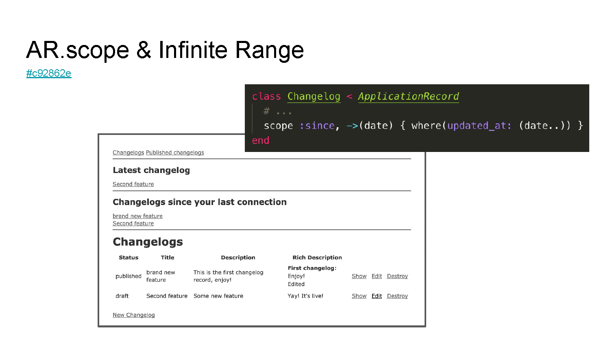

## [`#14657fb`](https://github.com/perangusta/one-day-in-rails6-world/commit/14657fb) - ActionView Allocation Instrumentation

Our homepage looks now crowded by our widgets and changelogs list. Let's create a `partial` to clean our code.

Wait! Did you see the logs? Now Rails shows the number of allocated Ruby objects per partial. It allows us to focus our effort of performance improvement by quickly finding large allocations in our views.

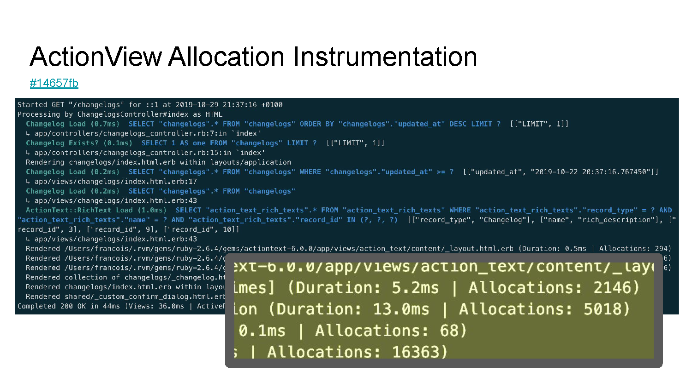

## [`#caa5ba5`](https://github.com/perangusta/one-day-in-rails6-world/commit/caa5ba5) - Multi databases

To fulfill our `Changelog` model, what about attaching the contributors to them. Assuming our list of contributors already exist in a third-party application, we can take advantage of multi database support in Rails 6. Our setup is done on a per-model basis so that the contributors are fetched from external database.

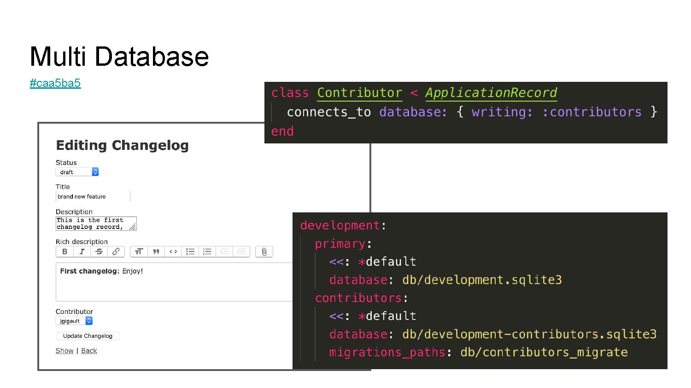

## [`#53f054b`](https://github.com/perangusta/one-day-in-rails6-world/commit/53f054b) - ActionMailbox

Finally, let's allow the contributors to create new changelogs outside of the Web application context. Using the brand new `ActionMailbox` interface, we can catch emails from the collaborators and implement business logic in our application, like the creation of changelog!

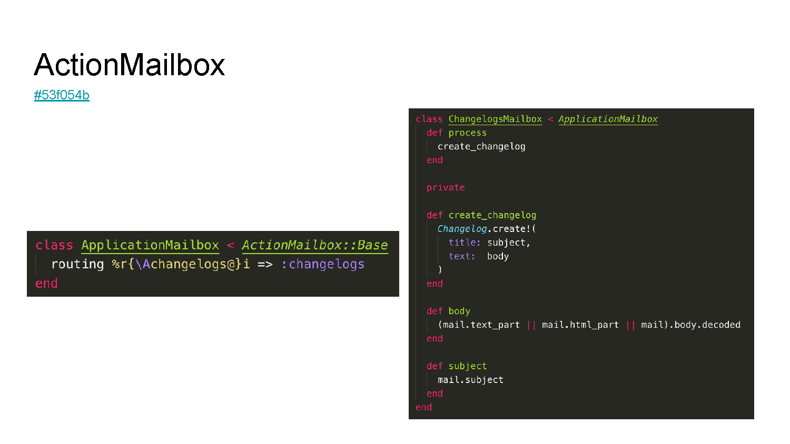

## Conclusion

...

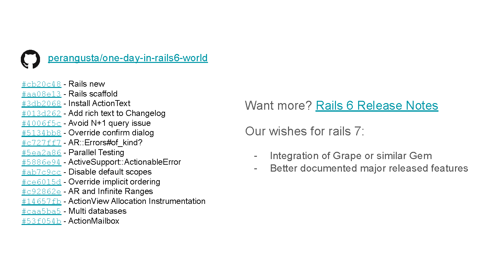

## References

- https://edgeguides.rubyonrails.org/6_0_release_notes.html
- https://edgeguides.rubyonrails.org/testing.html#parallel-testing
- https://edgeguides.rubyonrails.org/action_text_overview.html
- https://edgeguides.rubyonrails.org/active_record_multiple_databases.html
- https://edgeguides.rubyonrails.org/action_mailbox_basics.html
- https://github.com/rails/rails/issues/36177
- https://github.com/rails/rails/pull/32404
- https://github.com/rails/rails/pull/34605
- https://github.com/rails/rails/pull/34480
- https://github.com/rails/rails/pull/34906
- https://github.com/rails/rails/pull/34136
- https://api.rubyonrails.org/classes/ActiveSupport/ActionableError.html
- https://api.rubyonrails.org/classes/ActiveModel/Errors.html#method-i-of_kind-3F
